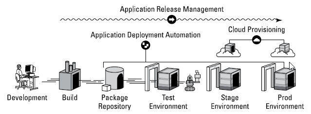

Author: Samuel Solorzano Ramirez (A00354798)

Course: Software Engineering

DevOps
=====

DevOps applies agile and lean principles across the entire software supply chain.

Principles:
-----

1. Develop and test against production-like systems
   Allow development and quality assurance (QA) teams to develop and test against systems that behave like the production system, so that they can see how the application  behaves and performs well before it’s ready for deployment.
2. Deploy with repeatable, reliable processes
    Create processes that are iterative, frequent, repeatable, and reliable, so the organization must create a delivery pipeline that allows for continuous, automate deployment and testing.
3. Monitor and validate operational quality
    Automated testing be done early and often in the life cycle to monitor functional and nonfunctional characteristics of the application.
4. Amplify feedback loops
    Get quick feedback and then learn rapidly from every action it takes.

DevOps Reference architecture: 
-----

1. Steer
   Establish business goals and continuously change them based on customer feedback, thereby improving both agility and business outcomes. At the same time, businesses need to manage costs.
2. Develop/Test
   Developers must regularly integrate their work with that of the rest of the developers on their team and then test the integrated work. Continues Integration.
3. Deploy
   Continuous Deployment.
4. Operate
   Allow businesses to monitor how released applications are performing in production and to receive feedback from customers.

People in DevOps:
-----

DevOps is a cultural movement; it’s all about people.

A DevOps culture is characterized by a high degree of collaboration across roles, focus on business instead of departmental objectives, trust, and high value placed on learning through experimentation.

Process in DevOps:
------

DevOps as a capability affects a whole business. It makes the business more agile and improves its delivery of capabilities to customers.

Change management should include processes that enable the following capabilities:

- Work-item management
- Configurable work-item workflows
- Project configuration management
- Planning (agile and iterative)
- Role-based artifact access control

DevOps techniques:

Following are a few specific techniques that you need to include when you adopt DevOps:

- Continuous improvement
    Builtin processes that identify areas for improvement
- Release planning
- Continuous integration
- Continuous delivery
- Continuous testing
- Continuous monitoring and feedback

Technology in DevOps
-----

Infrastructure as a code:

Infrastructure as code is a core capability of DevOps that allows organizations to manage the scale and the speed with which environments need to be provisioned and configured to enable continuous delivery.

1. Application- or middleware-centric tools: 
    These tools usually are capable of managing as code both application servers and the applications that run on them. Such tools are specialized, bundled with libraries of typical automation tasks for the technologies that they support. They can’t perform low-level tasks such as configuring an operating system (OS) setting, but they can fully automate server and application-level tasks.
2. Environment and deployment tools: 
    These tools are a new class of tools that have the capability to deploy both the infrastructure configurations and application code.  
3. Generic tools: 
    These tools aren’t specialized for any technology and can be scripted to perform several kinds of tasks, all the way from configuring an OS on a virtual or physical node to configuring firewall ports. They require much more work up front than application- or middleware centric tools do, but they can handle a greater range of tasks.

Delivery pipeline:

A delivery pipeline consists of the stages an application goes through from development through to production.

- Development environment
    Provides multiple tools that enable the developers to write and test code.
- Build stage
    Is where the code is compiled to create and unit test the binaries to be deployed.
- Package repository
    Is a common storage mechanism for the binaries created during the build stage.
- Test environment
    Is where the QA, user acceptance, and development/testing teams do the actual testing.
- Stage and production environments
    Applications are deployed in the staging and production environments.