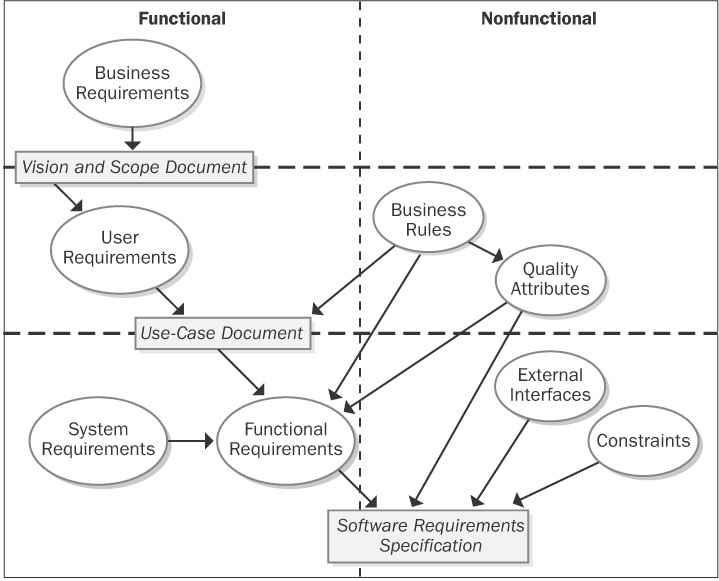
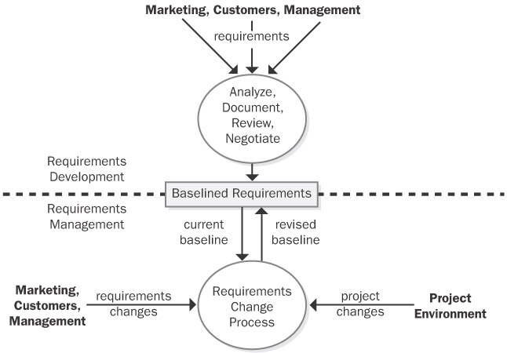
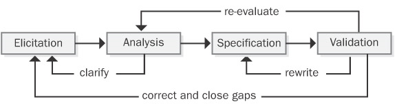

Author: Samuel Solorzano Ramirez (A00354798)

Course: Software Engineering

The Essential Software Requirement
=====

Many software problems arise from shortcomings in the ways that people gather, document, agree on, and modify the product's requirements.

Most people wouldn't ask a construction contractor to build a custom $300,000 house without extensively discussing their needs and desires and refining the details progressively. However, people blithely gloss over the corresponding issues when it comes to software development. Errors made during the requirements stage account for 40 to 60 percent of all defects found in a software project.

Requirements are the foundation for both the software development and the project management activities. Handled well, can lead to exciting products, delighted customers, and fulfilled developers. Handled poorly, it's the source of misunderstanding, frustration, and friction that undermine the product's quality and business value.

Software Requirements Defined 
-----

One problem with the software industry is the lack of common definitions for terms we use to describe aspects of our work. A customer's definition of requirements might sound like a high-level product concept to the developer. The developer's notion of requirements might sound like detailed user interface design to the user.

A key concept is that the requirements **_must be_** documented.

### Interpretations of Requirements

Consultant Brian Lawrence suggests that a requirement is "anything that drives design choices"

The IEEE Standard Glossary of Software Engineering Terminology (1990) defines a requirement as:

1. A condition or capability needed by a user to solve a problem or achieve an objective.
2. A condition or capability that must be met or possessed by a system or system component to satisfy a contract, standard, specification, or other formally imposed document.
3. A documented representation of a condition or capability as in 1 or 2.

Karl E. Wiegers (Author of the book) thinks of a requirement as a property that a product must have to provide value to a stakeholder.

Sommerville and Sawyer 1997 say:
> Requirements are…a specification of what should be implemented. They are descriptions of how the system should behave, or of a system property or attribute. They may be a constraint on the development process of the system.

### Levels of Requirements

Software requirements include three distinct levels:

- Business requirements
  - Represent high-level objectives of the organization or customer who requests the system.
- User requirements
  - User requirements therefore describe what the user will be able to do with the system.
- Functional requirements.
  - specify the software functionality that the developers must build into the product to enable users to accomplish their tasks, thereby satisfying the business requirements. 

**Image: Relationship of several types of requirements information.**

*Business rules* include corporate policies, government regulations, industry standards, accounting practices, and computational algorithms. Sometimes business rules are the origin of specific quality attributes that are implemented in functionality. Therefore, you can trace the genesis of certain functional requirements back to a particular business rule.

Functional requirements are documented in a software requirements specification (SRS), which describes as fully as necessary the expected behavior of the software system.

The SRS additionally contains nonfunctional requirements, which includes performance goals and descriptions of quality attributes. *Quality attributes* augment the description of the product's functionality by describing the product's characteristics in various dimensions that are important either to users or to developers, like usability, portability, integrity, efficiency, and robustness. Other nonfunctional requirements describe external interfaces between the system and the outside world, and design and implementation constraints. *Constraints* impose restrictions on the choices available to the developer for design and construction of the product.

Product features, a *feature* is a set of logically related functional requirements that provides a capability to the user and enables the satisfaction of a business objective.

Example requirement for a **Word Processor**:

- **Business Requirement:** "The product will allow users to correct spelling errors in a document efficiently."
- **User Requirements:** "Find spelling errors", "Add word to global dictionary."
- **Functional Requirement:** The spell checker has many individual functional requirements, which deal with operations such as finding and highlighting a misspelled word, displaying a dialog box with suggested replacements, and globally replacing misspelled words with corrected words.
- **Nonfunctional requirements:** The quality attribute called usability would specify just what is meant by the word "efficiently" in the business requirement.

### What Requirements are not

Requirements specifications do not include design or implementation details (other than known constrains), project planning information, or testing information.

Requirements Development and Management
-----

### Development

We can subdivide it in elicitation, analysis, specification, and validation. It Encompass all the activities involved with gathering, evaluating, and documenting the requirements for a software or software-containing product.

Activities related to development:

- Identifying the product's expected user classes
- Eliciting needs from individuals who represent each user class
- Understanding user tasks and goals and the business objectives with which those tasks align
- Analyzing the information received from users to distinguish their task goals from functional requirements, nonfunctional requirements, business rules, suggested solutions, and extraneous information
- Allocating portions of the top-level requirements to software components defined in the system architecture
- Understanding the relative importance of quality attributes
- Negotiating implementation priorities
- Translating the collected user needs into written requirements specifications and models
- Reviewing the documented requirements to ensure a common understanding of the users' stated requirements and to correct any problems before the development group accepts them

**Iteration** is a key to requirements development success.

### Management

Entails "establishing and maintaining an agreement with the customer on the requirements for the software project".

Activities related to management:

- Defining the requirements baseline (a snapshot in time representing the currently agreed-upon body of requirements for a specific release)
- Reviewing proposed requirements changes and evaluating the likely impact of each change before approving it
- Incorporating approved requirements changes into the project in a controlled way
- Keeping project plans current with the requirements
- Negotiating new commitments based on the estimated impact of requirements changes
- Tracing individual requirements to their corresponding designs, source code, and test cases
- Tracking requirements status and change activity throughout the project

Every Project has Requirements
-----

Frederick Brooks eloquently stated : 
> The hardest single part of building a software system is deciding precisely what to build. No other part of the conceptual work is as difficult as establishing the detailed technical requirements, including all the interfaces to people, to machines, and to other software systems. No other part of the work so cripples the resulting system if done wrong. No other part is more difficult to rectify later.

Often, it's impossible to fully specify the requirements before commencing construction. In those cases, take an iterative and incremental approach to implement one portion of the requirements at a time, obtaining customer feedback before moving on to the next cycle. 

### No assumed Requirements

If you don't write down even the implicit and assumed requirements, don't be surprised if the software doesn't meet user expectations. Periodically ask, "What are we assuming?" to try to surface those hidden thoughts. If you come across an assumption during requirements discussions, write it down and confirm its accuracy. If you're developing a replacement system, review the previous system features to determine whether they're required in the replacement rather than assuming that they are or are not.

When Bad Requirements Happen to Nice People
-----

The major consequence of requirements problems is rework doing over something that you thought was already done. Rework can consume 30 to 50 percent of your total development cost, and requirements errors account for 70 to 85 percent of the rework cost.

Shortcomings in requirements practices pose many risks to project success, where success means delivering a product that satisfies the user's functional and quality expectations at agreed-on cost and schedule.

As changes propagate through the product being developed, its architecture can slowly crumble. Code patches make programs harder to understand and maintain. Added code can cause modules to violate the solid design principles of strong cohesion and loose coupling (McConnell 1993). To minimize this type of quality degradation, flow requirements changes through the architecture and design rather than implementing them directly into code.

Ambiguity is the great bugaboo of requirements specifications (Lawrence 1996). One symptom of ambiguity is that a reader can interpret a requirement statement in several ways. Ambiguity leads to different expectations on the part of various stakeholders. (Developers implementing a different solution, tester expecting a different outcome, etc)

Benefits from a High-Quality Requirements Process
-----

A great reward comes from reducing unnecessary rework during the late development stages and throughout the lengthy maintenance period.

No one can promise a specific return on investment from an improved requirements process, but the following benefits are real:

- Fewer requirements defects
- Reduced development rework
- Fewer unnecessary features
- Lower enhancement costs
- Faster development
- Fewer miscommunications
- Reduced scope creep
- Reduced project chaos
- More accurate system-testing estimates
- Higher customer and team member satisfaction

Characteristics of Excellent Requirements
-----

- Complete
  - Each requirement must fully describe the functionality to be delivered. 
- Correct
  - Each requirement must accurately describe the functionality to be built.
- Feasible
  - It must be possible to implement each requirement within the known capabilities and limitations of the system and its operating environment.
- Necessary
  - Each requirement should document a capability that the customers really need or one that's required for conformance to an external system requirement or a standard.
- Prioritized
  - Assign an implementation priority to each functional requirement, feature, or use case to indicate how essential it is to a particular product release.
- Unambiguous
  - All readers of a requirement statement should arrive at a single, consistent interpretation of it, but natural language is highly prone to ambiguity.
- Verifiable
  - See whether you can devise a few tests or use other verification approaches, such as inspection or demonstration, to determine whether the product properly implements each requirement.
- Complete
  - No requirements or necessary information should be absent.
- Consistent
  - Consistent requirements don't conflict with other requirements of the same type or with higher-level business, system, or user requirements. 
- Modifiable
  - You must be able to revise the SRS when necessary and to maintain a history of changes made to each requirement.
- Traceable
  - A traceable requirement can be linked backward to its origin and forward to the design elements and source code that implement it and to the test cases that verify the implementation as correct.

Good Practices for Requirements
=====

- Educate user representatives and managers about software requirements.
- Train developers in application domain concepts.
- Create a project glossary.

Requirement Elicitation
-----

- Write a vision and scope document.
  - Contains the product's business requirements.
- Identify user classes and their characteristics.
- Select a product champion for each user class.
- Establish focus groups of typical users.
- Work with user representatives to identify use cases.
  - Discuss the interactions between the users and the system that will allow them to complete each such task.
- Identify system events and responses.
  - List the external events that the system can experience and its expected response to each event. 
- Hold facilitated elicitation workshops.
  - Facilitated requirements-elicitation workshops that permit collaboration between analysts and customers are a powerful way to explore user needs and to draft requirements documents.
- Examine problem reports of current systems for requirement ideas.
  - Problem reports and enhancement requests from customers provide a rich source of ideas for capabilities to include in a later release or in a new product.
- Reuse requirements across projects. 

Requirement Analysis
-----

Involves refining the requirements to ensure that all stakeholders understand them and scrutinizing them for errors, omissions, and other deficiencies.

- Draw a context diagram.
- Create user interface and technical prototypes.
- Analyze requirement feasibility.
- Prioritize the requirements.
- Model the requirements.
- Create a data dictionary.
- Allocate requirements to subsystems.
- Apply Quality Function Deployment.

Requirement Specification
-----

No matter how you obtain your requirements, document them in some consistent, accessible, and reviewable way.

- Adopt an SRS template.
- Identify sources of requirements.
- Uniquely label each requirement.
- Record business rules.
- Specify quality attributes.

Requirement Validation
-----

Validation ensures that the requirement statements are correct, demonstrate the desired quality characteristics, and will satisfy customer needs.

- Inspect requirements documents.
- Test the requirements.
- Define acceptance criteria.

Requirement Management
-----

Once you have the initial requirements for a body of work in hand, you must cope with the inevitable changes that customers, managers, marketing, the development team, and others request during development

- Define a requirements change-control process.
- Establish a change control board.
- Perform requirements-change impact analysis.
- Establish a baseline and control versions of requirements documents.
- Maintain a history of requirements changes.
- Track the status of each requirement.
- Measure requirements volatility.
- Use a requirements management tool. 
- Create a requirements traceability matrix.

Project Management
-----

Base your project resources, schedules, and commitments on the requirements that are to be implemented.

- Select an appropriate software development life cycle.
- Base project plans on requirements.
- Renegotiate project commitments when requirements change.
- Document and manage requirements-related risks.
- Track the effort spent on requirements engineering
- Review lessons learned regarding requirements on other projects.

A Requirements Development Process
-----

Don't expect to perform the requirements development activities of elicitation, analysis, specification, and validation in a linear, one-pass sequence. In practice, these activities are interleaved, incremental, and iterative.

