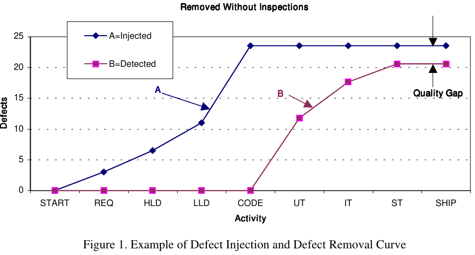
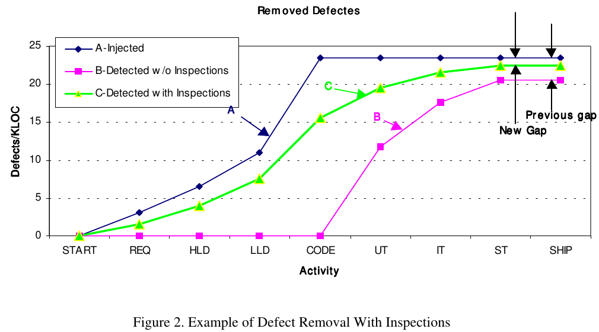

Author: Samuel Solorzano Ramirez (A00354798)

Course: Software Engineering

Software Inspections
=====

When practicing Inspections one should always work to achieve effectiveness first, then, while maintaining high effectiveness, work to improve the efficiency.

Why Inspections?
-----

Inspections enable us to remove defects early in the software life cycle, and it is always cheaper to remove defects earlier than later in the software life cycle.

In the following example let’s assume that each test removes 50% of the defects present at entry to the
test; e.g., UT, IT, ST.

The gap that remains at the end of system test (ST) represents latent defects that have the potential to be found by the users.

There is still a gap of latent defects that the users could potentially find. In the scenario, with Inspections, the gap is smaller, due to the defects removed by Inspections. This reduced gap represents a quality improvement in the product delivered to the users.

Why Inspection is cheaper:

- In Inspections all identified defects are noted in the same proximate time period and the recurring costs are consequently reduced. And we usually know how to fix it. The need for the iterative process is not needed (report the bug, debug, find, solve, send to test, etc...)
- When fewer defects enter test, the productivity of test improves; i.e., the costs of test are lower and the time to complete test is reduced.

Inspections have clear value independent of any model or standard for software development.

Effectiveness and Efficiency
-----

### Effectiveness

Simply stated, effectiveness of Inspections is the percentage of defects removed by Inspections compared to the total sum of defects eventually found by Inspections, test, and in use by the customers.

### Efficiency

Efficiency of Inspections is represented by various cost relationships; e.g., :

- $ spent / defect found in Inspections
- $ for Inspections / total project costs; this is a subset of Cost of Quality (COQ) measures
- $ ratio of cost of finding defects in Inspection to cost of defects found in test and by the customers
- hours spent / defect found in Inspections

We use Inspections to find defects earlier because the costs for defect removal are reduced, then this is a measure of the efficiency. The more defects the higher the cost to remove them. Therefore, the lower the cost to remove defects the more efficient we are.

1:1 Inspections
-----

1:1 Inspections occur when there are only two participants in an Inspection, the Producer and the Inspector/Moderator. If you can perform a 1:! Inspection you can typically save about 50% compared to the traditional Inspection.

Can Inspections replace test?
-----

Ackerman found that the savings from defect detection costs in Inspections was 2.2 hours compared to 4.5 hours in unit test.

Weller [WEL93] states that there are disadvantages of inspecting after unit test:

- Unit test leads programmers to have false confidence that the product works, so why inspect
- It is a hard decision to inspect a large batch that has been unit tested and there may be the view that there is no longer time to inspect

He also gives reasons to perform Inspections first:
- You may actually be able to bypass unit test if the Inspection results are good
- You can recover earlier with lower cost to serious design defects found in Inspections versus unit test

Solo: Inspections
-----

In the Solo:Inspections, the inspector logs on to his workstation and brings up the work product to be inspected. He has all required documents available through the organization’s intranet for ancillary and reference documents he may need. He has access to the appropriate checklist, standards, and forms to record any defects found.

Another benefit is that the Inspection can be for longer than two hours, as the inspector can start and stop, chunking as he feels necessary.

We should recognize that Solo:Inspections would permit that we could use experts who are not part of our project, organization, or even company to perform Inspections for us on some work products.
