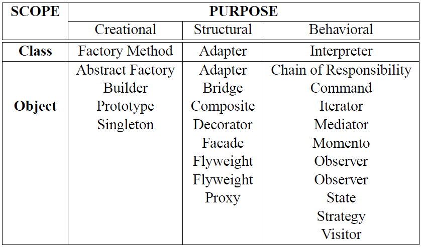

Author: Samuel Solorzano Ramirez (A00354798)

Course: Software Engineering

What is a pattern?
=====

Definition
-----

Patterns are effective means of communication between software developers.

Definition of a pattern given by Alexander:

>Each pattern describes a problem which occurs over and over again in our environment, and then describes the core of the solution to that problem, in such a way that you can use this solution a million times over, without ever doing it the same way twice.

Definition of a software pattern by Coplein:

> ...the thing and the instructions for making the thing.

Pattern Misconceptions
-----

- Patterns are only object-oriented
  - Are applicable to every software system, since they describe software abstractions.
- Patterns provide only one solution
  - They provide more that one solution since a pattern only describes when, why, and how one could create an implementation.
- Patterns are implementations
- Every solution is a pattern
  - The solution must be verified as recurring solution to a recurring problem, to be considered as a pattern.

Pattern Characteristics
-----

- Context
  - A design situation giving rise to a design problem.
- Problem
  - A set of forces occurring in that context.
- Solution
  - A form or rule that can be applied to resolve these forces.

Classification of software patterns
=====

In general, all software patterns can be classified as generative and non-generative.

Generative and non-generative patterns
-----

Patterns that can be observed in a system, which has already been built are considered to be non-generative patterns. Generative patterns, on the other hand, are designed to shape system architecture, and can generate systems or parts of the systems.

Types of software patterns
-----

- Design patterns
  - Patterns in software engineering.
- analysis patterns
  - Patterns that describe recurring and reusable analysis models.
- Organization patterns
  - Patterns that describe software process design.
- other domain-specific patterns.

Types of design patterns
-----

- Architectural patterns
  - high-level strategies that are concerned with large-scale components and global properties and mechanisms of a system.
- Design patterns
  - medium-level strategies that are concerned with the structure and behavior of entities, and their relationships.
- idioms
  - paradigm-specific and language-specific programming techniques that fill in low-level internal or external details of a component’s structure or behavior

Pattern templates
=====

Alexandrian form
-----

Elements (sections) that constitute an Alexandrian form for describing a pattern:

- Name The pattern must have a meaningful name.
- Problem The statement of the problem the pattern is trying to solve.
- Context A situation giving rise to a problem.
- Forces A concrete scenario, i.e., description of forces.
- Solution Proven solution to the problem.
- Examples A sample of the application of the pattern.
- Resulting context The state of the system after the pattern has been applied.
- Rationale Explanation of steps or rules in the pattern.
- Related patterns Static and dynamic relationship between other patterns.
- Known use Occurrences of the pattern within the existing systems.

GoF format
-----

Elements (sections) that constitute an GoF format for describing a pattern:

- Name and classification Classification according to Gamma et al. [9].
- Intent A problem that the pattern addresses.
- Also known as Other well-known names of the pattern.
- Motivation A scenario illustrating a design problem.
- Applicability Situations where pattern can be applied.
- Structure A graphical representation of classes in the pattern.
- Participants Classes and objects and their relationships.
- Collaboration Participants collaborating to carry out responsibilities.
- Consequences Trade-offs and results of using a pattern.
- Implementation Things to be aware of when implementing a pattern.
- Sample code Code fragment illustrating one implementation.
- Known uses Examples of patterns found in real systems.
- Related patterns Other closely related patterns.

Pattern language, pattern system and pattern catalog
=====

Pattern language
-----

Commonly used definition of pattern language:

> A pattern language defines a collection of patterns and the rules to combine them into an architectural style. Pattern languages describe software frameworks or families of related systems.

Pattern System
-----

Defined as: 

> A pattern system is a cohesive set of related patterns which work together to support the construction and evolution of whole architectures. It describes many interrelationships between the patterns and their groupings and how they may be combined and composed to solve more complex problems.

Pattern catalog
-----

It's a collection of patterns.

Purpose of patterns can have either creational, structural, or behavioral purpose.

- Creational patterns
  - Object Creation
- Structural patterns
  - Composition of classes
- Behavioral patterns
  - Ways in which objects or classes interact

Scope of patterns specifies whether the pattern applies primarily on classes or on objects

- Class patterns
  - Deal with relationships between classes and their sub-classes.
- Object pattern
  - deal with object relationships, which are more dynamic and can be changed at run-time.

